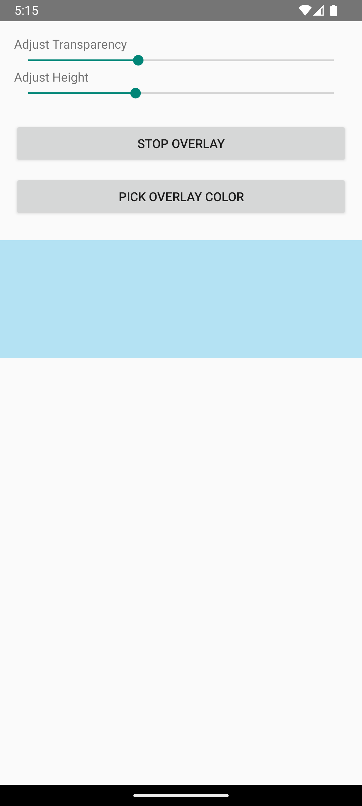

# 📚 Focus Box: A Transparent Overlay for Focused Reading

**Focus Box** is a simple, powerful overlay tool that helps you focus while reading long texts on tablets or smartphones. It creates a customizable transparent box that floats above all apps—ideal for reading EPUBs, PDFs, or long web articles without distractions.

Originally developed for my personal use while reading novels on a Samsung tablet, **Focus Box** is now open source and available for anyone looking to improve their reading experience.

---

## 🎥 Demo



📺 [**Watch the demo video**](demo.webm)

---

## ✨ Features

- 🎨 **Customizable Overlay Box**  
  Adjust the height, color, and transparency to match your preferences and reading environment.

- 🖱️ **Draggable Anywhere**  
  Move the box freely to highlight your current reading section.

- 💾 **Remembers Your Preferences**  
  The box keeps its position and settings between app launches.

- 🧩 **Works Across All Apps**  
  Overlay floats on top of any reading app, perfect for EPUBs, PDFs, and web content regardless which app you are using.

---

## 💡 Use Cases

- Deep reading of novels, papers, and reports.
- Reducing eye fatigue and improving line tracking.
- Enhancing focus for readers with ADHD or visual processing difficulties.

---

## 🚀 Getting Started

### Installation

1. Download the latest APK from the [Releases](https://github.com/alifa98/FocusBox/releases) page.
2. Install the APK on your tablet or phone.
3. Grant any necessary overlay permissions when prompted.

### How to Use

1. Open **Focus Box**.
2. Adjust the overlay height, transparency, and color via the settings panel.
3. Drag it to your preferred reading zone.
4. Begin reading with improved focus and comfort.
5. The next time you launch the app, it will remember your last position and settings.

---

## 🛠️ Development

Want to contribute or build it yourself?

```bash

git clone https://github.com/alifa98/FocusBox.git
cd FocusBox

```

---

## 📜 License

This project is licensed under the MIT License. See the [LICENSE](LICENSE) file for details.

---

## 🙏 Acknowledgments

Thanks to the open source and accessibility communities for the inspiration behind this tool.

---

*Crafted with focus by Ali.
